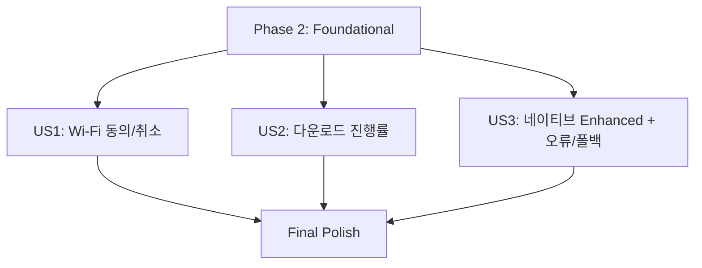

# Tasks: Enhanced AI 다운로드 및 고지 UX

**Input**: Design documents from `/Users/woong/home/01_woong/optimized-translator/specs/004-enhanced-ai-download-ux/`
**Prerequisites**:
- `plan.md` (required)
- `spec.md` (required)
- `research.md` (optional)
- `data-model.md` (optional)
- `contracts/*` (optional)
- `quickstart.md` (optional)

**Tests**: This task plan does not generate automated test tasks (manual QA + acceptance criteria focused).

---

## Phase 1: Setup (Shared Infrastructure)

**Purpose**: Enhanced 다운로드/동의/진행/에러 UX를 렌더링하는 UI 기반을 먼저 만든다.

- [ ] T001 [P] Extend `extension/src/content/overlay.ts` with `showDialog` (buttons + optional progress/variant) without breaking `showOverlay`
- [ ] T002 [P] Create `extension/src/content/enhanced-download-ui.ts` (wifi consent/progress/cancel/error dialogs) using the new `overlay.ts` dialog primitive
- [ ] T003 [P] Create `extension/src/content/enhanced-flow.ts` defining `EnhancedTranslationFlow` state + request-scoped cancellation guard helpers

---

## Phase 2: Foundational (Blocking Prerequisites)

**Purpose**: Enhanced 흐름이 실제 Translator API 다운로드를 수행하고, UI 상태를 올바르게 전환하며, fallback을 실행할 수 있게 만드는 공통 기반을 완료한다.

⚠️ CRITICAL: No user story work can begin until this phase is complete

- [ ] T004 [P] Implement native Translator download+translate with progress in `extension/src/lib/chrome/translator.ts` (support `create({ monitor })` and return cancel/destroy capability)
- [ ] T005 [P] Update `extension/src/content/main.ts` to pass `message.requestId` into `runEnhancedTranslation(...)`
- [ ] T006 [P] Refactor `extension/src/content/enhanced-translate.ts` to accept `requestId` and use `extension/src/content/enhanced-flow.ts` for request-scoped stale-cancel protection
- [ ] T007 [P] Add fallback helper `runDefaultSelectionTranslation(...)` in `extension/src/content/enhanced-translate.ts` using `translateWithGlossary(..., "selection")` with the original selection `text`

---

## Phase 3: User Story 1 - Wi-Fi 권장 고지 및 동의 (Priority: P1) 🎯 MVP

**Goal**: Enhanced 실행 시 다운로드가 필요하면, 다운로드 시작 전에 Wi‑Fi 권장 고지/명시적 동의(또는 취소) UI를 먼저 보여주고, 취소 시 enhanced가 취소되며 기본 번역으로 자동 전환하지 않는다.

**Independent Test**: 모델이 미다운로드 상태(`Translator.availability() -> downloadable`)가 되도록 만든 뒤 Enhanced를 요청하고, 다운로드 시작 이전에 Wi‑Fi 고지/동의 UI가 먼저 표시되는지 확인한다. 동의 거절/취소 시 다운로드가 시작되지 않고(진행 UI/monitor 실행 없이) enhanced 요청이 취소되며 자동으로 기본 번역이 실행되지 않는지 확인한다. “기본 번역으로 계속” 버튼만이 명시적 fallback을 수행해야 한다.

### Implementation for User Story 1

- [ ] T008 [US1] In `extension/src/content/enhanced-translate.ts`, detect `downloadable` via `checkTranslatorAvailability(...)` and show wifi consent dialog from `extension/src/content/enhanced-download-ui.ts` before calling native `Translator.create(...)`
- [ ] T009 [US1] Implement consent-stage cancel/decline in `extension/src/content/enhanced-translate.ts`: mark flow cancelled, close any consent UI, and ensure no download/progress translator session is created
- [ ] T010 [US1] Implement explicit fallback button from the cancelled state in `extension/src/content/enhanced-translate.ts` that triggers `runDefaultSelectionTranslation(...)` with the same original `text` and current `prefs.targetLanguage`

---

## Phase 4: User Story 2 - 다운로드 진행률 표시 (Priority: P2)

**Goal**: 동의가 확인되면 `Translator.create({ monitor })` 다운로드 진행 상태를 사용자에게 투명하게 보여주고, 완료/실패를 명확히 안내한다. 취소는 다운로드를 중단하고 enhanced 자동 전환을 하지 않는다.

**Independent Test**: 모델 다운로드가 필요한 상태에서 wifi 동의(“동의하고 다운로드”) 후 진행률 UI가 최소 2회 이상 갱신되는지 확인한다. 완료 시 enhanced 결과 오버레이가 표시되는지 확인한다. 진행 중 취소를 눌렀을 때 다운로드가 중단되고 “취소됨” 상태 안내와 명시적 다음 행동(기본 번역으로 계속)이 제공되는지 확인한다. 자동 전환은 발생하면 안 된다.

### Implementation for User Story 2

- [ ] T011 [US2] In `extension/src/content/enhanced-translate.ts`, wire “동의하고 다운로드” to native download+translate execution via the new monitor-capable API in `extension/src/lib/chrome/translator.ts`, while updating `EnhancedTranslationFlow`
- [ ] T012 [P] [US2] Implement download progress rendering logic in `extension/src/content/enhanced-download-ui.ts` (handle loaded/total percent and indeterminate/phase transitions if applicable)
- [ ] T013 [US2] Implement in `extension/src/content/enhanced-translate.ts` cancel-during-downloading: call destroy/cancel capability from `extension/src/lib/chrome/translator.ts`, mark cancelled, stop progress updates, and show cancelled state + fallback action
- [ ] T014 [US2] Implement in `extension/src/content/enhanced-translate.ts` success and failure handling: on success show enhanced result, on failure show error state + explicit fallback button; never auto-switch to default without button click

---

## Phase 5: User Story 3 - Chrome 네이티브 AI 기반 향상된 번역 (Priority: P3)

**Goal**: Enhanced는 Chrome 네이티브 AI(Translator API)로만 동작하며, 가용성이 없거나 다운로드/설치가 실패하면 원격 제3자 번역처럼 자동 대체하지 않고 명확한 오류 메시지와 “기본 번역으로 계속”을 제공한다.

**Independent Test**: Enhanced 가용성이 없거나 다운로드가 차단되도록 만든 뒤 Enhanced 요청 시, 명확한 오류 UI가 표시되고 “기본 번역으로 계속” 버튼이 즉시 selection 기반 기본 번역을 재시도하는지 확인한다. 이때 enhanced는 자동으로 기본 번역으로 전환되면 안 된다(버튼 클릭 전에는 화면/상태가 깨지면 안 됨).

### Implementation for User Story 3

- [ ] T015 [US3] In `extension/src/content/enhanced-translate.ts`, handle availability outcomes other than `downloadable` (e.g., `unavailable`) by showing a native enhanced error state from `extension/src/content/enhanced-download-ui.ts` + explicit fallback action
- [ ] T016 [US3] In `extension/src/content/enhanced-translate.ts`, map native download/translate errors to user-friendly messages and show an error UI with “기본 번역으로 계속” while enforcing “no automatic fallback”
- [ ] T017 [US3] Remove enhanced path usage that depends on background `pathKind: "enhanced"` in `extension/src/content/enhanced-translate.ts` (Enhanced should call Translator API native flow directly)
- [ ] T018 [US3] Ensure fallback button always retries the same request input using `runDefaultSelectionTranslation(...)` in `extension/src/content/enhanced-translate.ts` (same original `text` + same `prefs.targetLanguage`)

---

## Phase N: Polish & Cross-Cutting Concerns

**Purpose**: 상태/오버레이 정합성, 디버깅 가능성, 문서화/QA 연결을 개선한다.

- [ ] T019 [P] Update `extension/src/content/enhanced-ui.ts` to align result/error presentation with the new enhanced dialog/overlay variants (avoid conflicting overlays)
- [ ] T020 [P] Add structured logging + state breadcrumbs in `extension/src/content/enhanced-translate.ts` and `extension/src/lib/chrome/translator.ts` for: consent-open, consent-accepted, download-progress, cancelled, failed, completed
- [ ] T021 [P] Update `specs/004-enhanced-ai-download-ux/quickstart.md` to reflect the final UI labels/states used by this implementation (wifi-consent-open/progress-open/error-open/result-open)

---

## Dependencies & Execution Order

### Phase Dependencies

- Setup (Phase 1): No dependencies - can start immediately
- Foundational (Phase 2): Depends on Setup completion - BLOCKS all user stories
- User Stories (Phase 3+): Depend on Foundational completion
- Polish (Final Phase): Depends on desired user stories being complete

### User Story Dependencies

- User Story 1 (P1): Depends on Phase 2 only
- User Story 2 (P2): Depends on Phase 2 only (may reuse the same consent UI; story acceptance is independently valid)
- User Story 3 (P3): Depends on Phase 2 only



### Parallel Opportunities

- Phase 1 tasks marked `[P]` can run in parallel
- Phase 2 tasks marked `[P]` can run in parallel (after Phase 1 completion)
- Within a story, tasks marked `[P]` can run in parallel

---

## Parallel Example: User Story 1

```bash
Task: "T008 In `extension/src/content/enhanced-translate.ts` ... downloadable -> wifi consent"
Task: "T009 [US1] consent-stage cancel/decline stops download"
Task: "T010 [US1] cancelled state fallback button triggers selection default translation"
```

---

## Parallel Example: User Story 2

```bash
Task: "T011 [US2] consent-accepted -> monitor-capable native download+translate"
Task: "T012 [P] [US2] progress rendering logic in enhanced-download-ui.ts"
Task: "T013 [US2] cancel during downloading -> destroy/cancel"
Task: "T014 [US2] success/failure UI + explicit fallback"
```

---

## Parallel Example: User Story 3

```bash
Task: "T015 [US3] unavailable -> error UI + fallback"
Task: "T016 [US3] error mapping + enforce no automatic fallback"
Task: "T017 [US3] ensure enhanced uses native Translator API directly"
Task: "T018 [US3] fallback retries same input via runDefaultSelectionTranslation"
```

---

## Implementation Strategy

### MVP First (User Story 1 Only)

1. Complete Phase 1 (UI primitives + state helper)
2. Complete Phase 2 (requestId wiring + native monitor-capable plumbing + fallback helper)
3. Implement Phase 3 (US1) only
4. STOP and validate US1 independently using the acceptance criteria in `spec.md` and scenarios in `quickstart.md`

### Incremental Delivery

1. Add US2 (progress UI + cancel during downloading) and validate independently
2. Add US3 (unavailable/failure behavior + explicit fallback semantics) and validate independently
3. Finish Final Polish

---

## Completeness Validation

For each user story:

- US1 covers: wifi consent ordering, cancel/decline semantics, and explicit “기본 번역으로 계속” fallback button
- US2 covers: consent-accepted native download with progress updates, cancellation during downloading, and success/failure UI behavior
- US3 covers: non-downloadable availability/error outcomes, native-only enhanced execution, and no automatic fallback with correct retry behavior

---

## Task Count Report

- Total tasks: 21
- US1 tasks: 3
- US2 tasks: 4
- US3 tasks: 4
- Cross-cutting tasks (Final): 3

